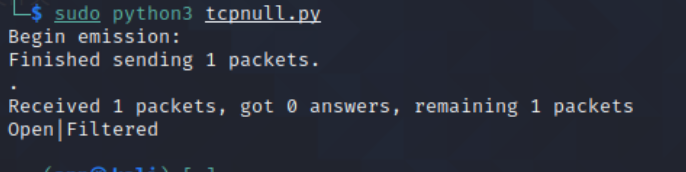

## 网络安全第五章实验报告

### 实验目的

- 掌握网络扫描之端口状态探测的基本原理

### 实验环境

python + scapy 2.4.3

nmap

### 网络拓扑结构


 网关 172.16.111.1 


 攻击者主机 kali-attacker 


 目标靶机 victim-kali-1 


### 实验要求

完成以下扫描技术的编程实现

- TCP connect scan / TCP stealth scan
- TCP Xmas scan / TCP fin scan / TCP null scan
- UDP scan
- 上述每种扫描技术的实现测试均需要测试端口状态为：开放、关闭和过滤状态时的程序执行结果
- 提供每一次扫描测试的抓包结果并分析与课本中的扫描方法原理是否相符？如果不同，试分析原因
- 在实验报告中详细说明实验网络环境拓扑、被测试 IP 的端口状态是如何模拟的
- （可选）复刻nmap的上述扫描技术实现的命令行参数开关

### 实验过程

1.端口状态模拟

关闭状态

```
sudo ufw disable
```

```
systemctl stop apache2
```

```
systemctl stop dnsmasq
```

开放状态

systemctl start apache2

systemctl start dnsmasq 

被过滤状态

```
sudo ufw enable && sudo ufw deny 80/tcp
sudo ufw enable && sudo ufw deny 53/udp
```

### TCP connect scan

#攻击者主机编写TCPconnect.py

```python
from scapy.all import *
def tcpconnect(dst_ip,dst_port,timeout=10):
    pkts=sr1(IP(dst=dst_ip)/TCP(dport=dst_port,flags="S"),timeout=timeout)
    if (pkts is None):
        print("FILTER")
    elif(pkts.haslayer(TCP)):
        if(pkts[1].flags=='AS'):
            print("OPEN")
        elif(pkts[1].flags=='AR'):
                print("CLOSE")
tcpconnect('172.16.111.108',80)
```

##### 关闭状态：

 靶机检测自身端口状态 


 攻击者主机运行TCP connect scan python脚本 


靶机的Wireshark抓包


 攻击者主机nmap复刻 


##### 开放状态：

 攻击者主机运行TCP connect scan python脚本 


 靶机Wireshark抓包 


 攻击者主机nmap复刻 


 分析：TCP三次握手机制，攻击者主机向靶机发送连接请求后，收到靶机返回[SYN/ACK]数据包，抓包结果与预期结果一致。 

##### 被过滤状态

 攻击者主机运行TCP connect scan python脚本 


 靶机Wireshark抓包 


 攻击者主机nmap复刻 


 分析：TCP三次握手机制，攻击者主机向靶机发送连接请求后，没有得到任何响应，抓包结果与预期结果一致。 

### TCP stealth scan 

攻击者主机编写 tcpstealth.py：

```python
from scapy.all import *
def tcpstealthscan(dst_ip , dst_port , timeout = 10):
    pkts = sr1(IP(dst=dst_ip)/TCP(dport=dst_port,flags="S"),timeout=10)
    if (pkts is None):
        print ("Filtered")
    elif(pkts.haslayer(TCP)):
        if(pkts.getlayer(TCP).flags == 0x12):
            send_rst = sr(IP(dst=dst_ip)/TCP(dport=dst_port,flags="R"),timeout=10)
            print ("Open")
        elif (pkts.getlayer(TCP).flags == 0x14):
            print ("Closed")
        elif(pkts.haslayer(ICMP)):
            if(int(pkts.getlayer(ICMP).type)==3 and int(stealth_scan_resp.getlayer(ICMP).code) in [1,2,3,9,10,13]):
                print ("Filtered")
tcpstealthscan('172.16.111.108',80)
```

##### 关闭状态：


 靶机Wireshark抓包 


 攻击者主机nmap复刻 


##### 开放状态 


靶机Wireshark抓包


 攻击者主机nmap复刻 


##### 被过滤状态


 靶机Wireshark抓包 


 攻击者主机nmap复刻 


### TCP Xmas scan

攻击者主机编写tcpxmas.py：

```python
from scapy.all import *
def Xmasscan(dst_ip , dst_port , timeout = 10):
    pkts = sr1(IP(dst=dst_ip)/TCP(dport=dst_port,flags="FPU"),timeout=10)
    if (pkts is None):
        print ("Open|Filtered")
    elif(pkts.haslayer(TCP)):
        if(pkts.getlayer(TCP).flags == 0x14):
            print ("Closed")
    elif(pkts.haslayer(ICMP)):
        if(int(pkts.getlayer(ICMP).type)==3 and int(pkts.getlayer(ICMP).code) in [1,2,3,9,10,13]):
            print ("Filtered")
Xmasscan('172.16.111.108',80)
```

##### 关闭状态

 靶机Wireshark抓包 


 攻击者主机nmap复刻 


 分析：Xmas发送TCP请求，在靶机端口关闭状态下，靶机响应[RST，ACK]，抓包结果与预期结果一致。 

##### 开放状态：


 靶机Wireshark抓包 


攻击者主机nmap复刻


 分析：Xmas发送TCP请求，在靶机端口开放状态下，靶机无响应，抓包结果与预期结果一致。 

##### 被过滤状态


 靶机Wireshark抓包 


 攻击者主机nmap复刻 


 分析：Xmas发送TCP请求，在靶机端口被过滤状态下，靶机无响应，抓包结果与预期结果一致。 

### TCP fin scan 

攻击者主机编写tcpfin.py：

```python
from scapy.all import *
def finscan(dst_ip , dst_port , timeout = 10):
    pkts = sr1(IP(dst=dst_ip)/TCP(dport=dst_port,flags="F"),timeout=10)#发送FIN包
    if (pkts is None):
        print ("Open|Filtered")
    elif(pkts.haslayer(TCP)):
        if(pkts.getlayer(TCP).flags == 0x14):
            print ("Closed")
    elif(pkts.haslayer(ICMP)):
        if(int(pkts.getlayer(ICMP).type)==3 and int(pkts.getlayer(ICMP).code) in [1,2,3,9,10,13]):
            print ("Filtered")
finscan('172.16.111.108',80)
```

##### 关闭状态：


 靶机Wireshark抓包 


 攻击者主机nmap复刻 


##### 开放状态


 靶机Wireshark抓包 


 攻击者主机nmap复刻 


##### 被过滤状态


 靶机Wireshark抓包 


攻击者主机nmap复刻


 ### TCP null scan 

攻击者主机编写tcpnull.py

```python
from scapy.all import *
def nullscan(dst_ip , dst_port , timeout = 10):
    pkts = sr1(IP(dst=dst_ip)/TCP(dport=dst_port,flags=""),timeout=10)
    if (pkts is None):
        print ("Open|Filtered")
    elif(pkts.haslayer(TCP)):
        if(pkts.getlayer(TCP).flags == 0x14):
            print ("Closed")
    elif(pkts.haslayer(ICMP)):
        if(int(pkts.getlayer(ICMP).type)==3 and int(pkts.getlayer(ICMP).code) in [1,2,3,9,10,13]):
            print ("Filtered")
nullscan('172.16.111.108',80)
```

##### 关闭状态


 靶机Wireshark抓包 


 攻击者主机nmap复刻 


##### 开放状态


 靶机Wireshark抓包 


攻击者主机nmap复刻


##### 被过滤状态



 靶机Wireshark抓包 


攻击者主机nmap复刻


### UDP scan

攻击者主机编写udp.py：

```python
from scapy.all import *
def udpscan(dst_ip,dst_port,dst_timeout = 10):
    resp = sr1(IP(dst=dst_ip)/UDP(dport=dst_port),timeout=dst_timeout)
    if (resp is None):
        print("Open|Filtered")
    elif (resp.haslayer(UDP)):
        print("Open")
    elif(resp.haslayer(ICMP)):
        if(int(resp.getlayer(ICMP).type)==3 and int(resp.getlayer(ICMP).code)==3):
            print("Closed")
        elif(int(resp.getlayer(ICMP).type)==3 and int(resp.getlayer(ICMP).code) in [1,2,9,10,13]):
            print("Filtered")
        elif(resp.haslayer(IP) and resp.getlayer(IP).proto==IP_PROTOS.udp):
            print("Open")
udpscan('172.16.111.108',53)
```

##### 关闭状态


 靶机Wireshark抓包 


 攻击者主机nmap复刻 


 分析：UDP扫描属于开放式扫描，靶机udp/53 端口关闭状态下，对攻击者主机并无任何响应，抓包结果与预期结果一致。 

##### 开放状态


靶机Wireshark抓包


 攻击者主机nmap复刻 


分析：UDP扫描属于开放式扫描，靶机udp/53 端口开启状态下，对攻击者主机并无任何响应，无法判断被过滤或开启，抓包结果与预期结果一致。

##### 被过滤状态

 靶机Wireshark抓包 


 攻击者主机nmap复刻 


分析：UDP扫描属于开放式扫描，靶机udp/53 端口被过滤状态下，对攻击者主机并无任何响应，无法判断被过滤或开启，抓包结果与预期结果一致。 