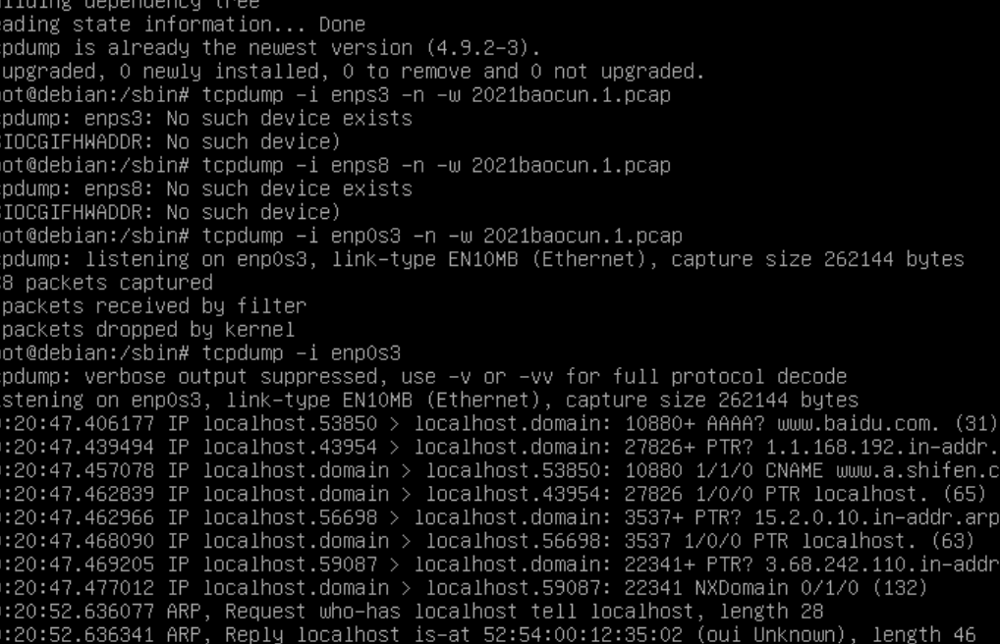

# 基于 VirtualBox 的网络攻防环境搭建

##### 2019302120121 信息安全2班 张秉杰

## 实验目的

###### 掌握 VirtualBox 虚拟机的安装与使用；

###### 掌握 VirtualBox 的虚拟网络类型和按需配置；

###### 掌握 VirtualBox 的虚拟硬盘多重加载；

## 实验环境

###### VirtualBox 虚拟机

###### 攻击者主机（Attacker）：Kali

###### 网关（Gateway）：Debian

###### 靶机（Victim）：Debian / xp-sp3 / Kali

## 实验要求

虚拟硬盘配置成多重加载

 网络拓扑图与搭建

 网络连通性测试

 靶机可以直接访问攻击者主机

 攻击者主机无法直接访问靶机

 网关可以直接访问攻击者主机和靶机

 靶机的所有对外上下行流量必须经过网关

 所有节点均可以访问互联网

## 实验过程

### 1.虚拟硬盘配置成多重加载

左上角打开管理，打开虚拟介质管理

选中对应虚拟盘，改为多重加载，释放盘片


创建6个虚拟机：kali，debain，xp系统各两个

其中一个作为攻击者，一个作为网关，另外4个作为靶机


 ##### 网关的四块网卡配置： 

NAT网络：网关可以访问攻击者主机

开启Host-Only：方便使用ssh

两块内部网络：搭建两个独立的局域网intnet1和intnet2


然后开始配置网卡（不需要配置，发现已经配置好了）

网卡配置结果：


#####  靶机配置

 xp配置时将控制芯片改成`Intel Pro/1000T` 服务器 


其IP：


 ##### Debian和Kali靶机只需要将网络改为拓扑图对应的内部网络。 

其ip：


kali victim直接访问 kali attacker


 

 Debian-victim-2访问kali-attacker 


 xp-victim-1访问kali-attacker 


 xp-victim-2访问kali-attacker 


##### 攻击者主机无法直接访问靶机


##### 网关可以直接访问攻击者主机和靶机

先关闭xp的防火墙


 靶机的所有对外上下行流量必须经过网关&所有节点均可以访问互联网

先在网关上安装tcpdump ， 并对对应网卡进行监控。在各个节点上访问互联网，观察捕获到了上下行的包 。

```
apt insatll tcpdump
```

然后cd进入user/sbin

执行 tcpdump ：-i enp0s3

网关可以访问互联网： 


 kali-attacker可以访问互联网 


 victim-kali-1可以访问互联网 


 上下行流量经过网关：


 victim-debian2可以访问互联网 


 xp-victim-1  可以访问互联网 


 上下行流量经过网关： 


 xp-victim-2可以访问互联网 


 上下行流量经过网关： 

